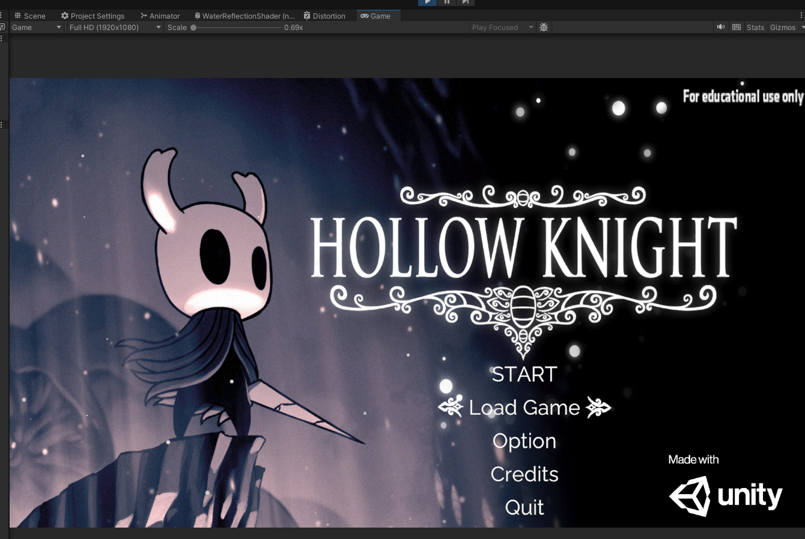
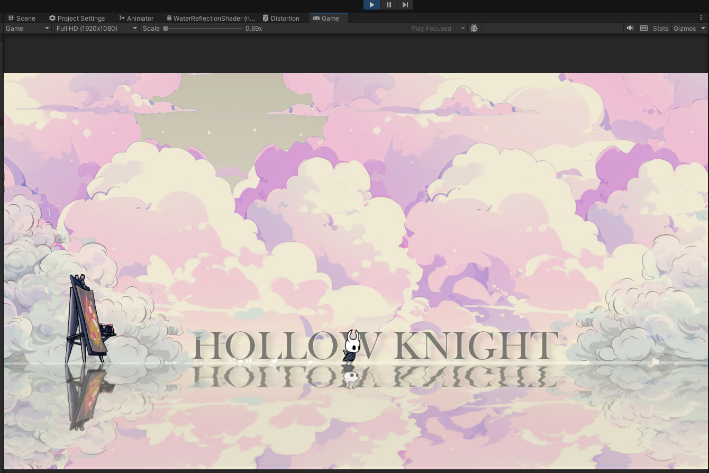
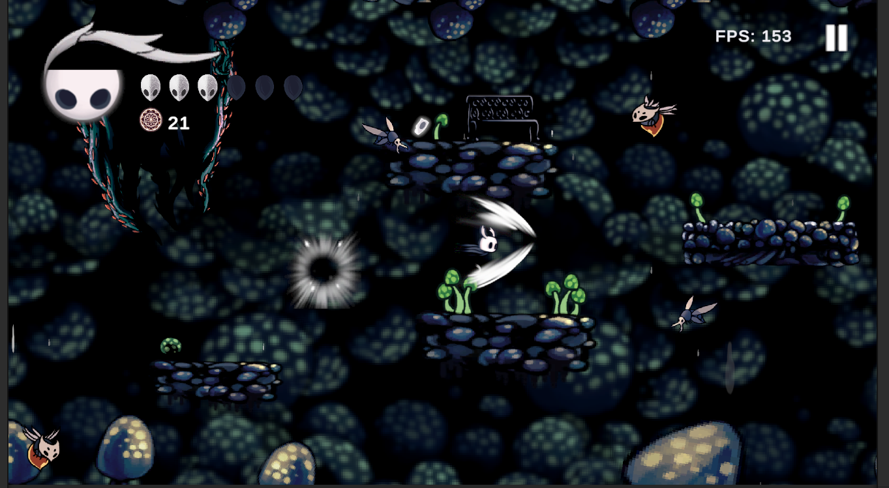

# 2D-Game-Platformer-Personal-Project
WORK IN PROGRESS

This is a learning project where I am developing a 2D platformer and action-adventure game inspired by *Hollow Knight*, built using Unity. The project serves as a hands-on experience to explore game development concepts such as level design, AI behavior, and sprite integration, animation and more.

The game is currently in development, and this repository contains the project files and assets.
-------------
### Features
- Gameplay Mechanic:
  - 2D platformer mechanics including movement, jumping, and dashing.
  - Basic combat system
  - Level design that encourages exploration and discovery.
- AI-controlled enemies with custom behaviors such as roaming, attacking, chasing.
- Player health, mana, and ability system that unlock as the game progress.
- Map and enviroment inspired by Hollow Knight.
- Basic Audio design: dynamic background music for different levels.
-------------
### Technologies & Tool used
- Unity LTS version 2022.3.24f1.
- C#: Programming language for gameplay mechanics.
- Aseprite: Sprite design and animation.
- Adobe Photoshop: Image editing and asset creation.
- Git: Version control system.
-------------
### Ingame Screenshots
- **Main Menu UI**

- **Tutorial Scene**

- **Map 1**

- **Map 2**

- **Map 3**

- **GameOver Scene**

-------------
### How to Play
- **Clone:**
  - Clone this repository:
    ```
    git clone https://github.com/Quochung2497/2D-Game-Platformer-Personal-Project.git
    ```
  - Open project in Unity LTS 2022.3.24f1.
  - Press Play in Unity Editor
- **Install:**
  - **Itch.io:** [download](https://quochung020497.itch.io/)
-------------
### Future Plans & Updates
- **Combat System Update:**
  - Introduce a talisman system that provides various buffs, debuffs, or special abilities.
  - Implement unique special abilities and spells to diversify gameplay.
  - Enhance attack combos and refine block/counter mechanics for more dynamic combat.
- **Levels:**
  -  **Redesign level to enhance user experience** and introduce additional unique challenges.
  -  Create more interactive elements, such as destructible environments, to immerse players further in the game world.
- **Enhanced Enemy AI:**
  - Add new enemy types, each with distinct and varied attack patterns.
  - Improve enemy AI to make combat encounters more challenging and engaging, pushing players to adapt and strategize.
- **Boss Fights:**
  - Implement major boss battles inspired by Hollow Knight.
  - **Redesign and enhance boss AI behavior** and **improve boss mechanics** for more engaging and challenging encounters.
- **UI/UX Improvements:**
  - Create more customizable settings for the options menu, including controller configuration, keyboard remapping, language settings, sound, graphics options,...etc.
  - Redesign existing HUD elements (player, boss, enemy, interactable objects, inventory, talisman, etc.) to enhance user experience, making them more visually appealing and easier to navigate.
- **Audio Enhancements:**
  - Implement multiple audio types (BGM, sound effects, environmental sounds, etc.) to better manage and enhance the overall sound experience.
  - Refine sound effects for a more immersive and accurate auditory experience in both combat and environmental interactions.
- **Optimization:**
  - Optimize game performance to ensure smoother gameplay, even on lower-end devices.
  - Reduce game file size efficiently without significantly compromising on visual or audio quality.
  - Implement more design pattern to optimize game performance (Object pooling, Observer pattern, Command Pattern ,..)
-------------
### Resources
For those interested in *Hollow Knight* sprites, you can find resources below:  
- **Hollow Knight Sprites (Voidheart Edition) 1.4.3.2:** [Google Drive Link](https://drive.google.com/drive/folders/1lx02_w9TFTYdR3aggI1gbXcLr69roaNV)  
- **Other Sprite Resources:** [Spriters-Resource](https://www.spriters-resource.com/pc_computer/hollowknight/)
